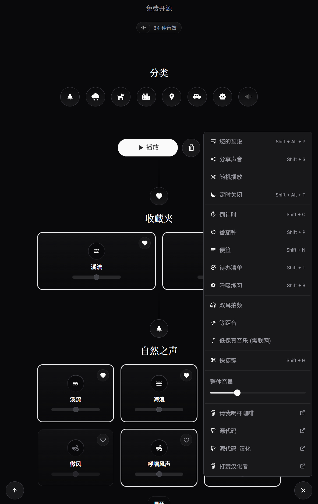

# 白噪音

- 原项目地址
  - 官网 https://moodist.mvze.net/
  - GitHub仓库 https://github.com/remvze/moodist
- 我汉化和构建docker镜像的仓库
  - GitHub仓库 https://github.com/Firfr/moodist-zh-cn
  - Gitee仓库 https://gitee.com/firfe/moodist-zh-cn
  - DockerHub https://hub.docker.com/r/firfe/moodist-zh-cn

## 汉化&修改&镜像制作

如果镜像拉取失败，请B站发私信，或提issues，  
华为云上的镜像仓库默认推送的镜像不是公开的，有可能是我忘记设置公开了。

当前制作镜像版本(或截止更新日期)：2.4.0

首先感谢原作者的开源。  
原项目没有中文，我就行了汉化，制作了中文docker镜像。

只做了汉化和简单修改，有问题，请到原作者仓库处反馈。

欢迎关注我B站账号 [秦曱凧](https://space.bilibili.com/17547201) (读作 qín yuē zhēng)  

有需要帮忙部署这个项目的朋友,一杯奶茶,即可程远程帮你部署，需要可联系。  
微信号 `E-0_0-`  
闲鱼搜索用户 `明月人间`  
或者邮箱 `firfe163@163.com`

如果这个项目有帮到你。欢迎start。也厚颜期待您的[打赏](https://gitee.com/firfe/me)。

如有其他问题，请提`issues`，或发送B站私信。

## 镜像

从阿里云或华为云镜像仓库拉取镜像，注意填写镜像标签，镜像仓库中没有`latest`标签

容器内部端口`8080`。

- 国内仓库
  - AMD64镜像
    ```bash
    swr.cn-north-4.myhuaweicloud.com/firfe/moodist:2.4.0
    ```
  - ARM64镜像
    ```bash
    swr.cn-north-4.myhuaweicloud.com/firfe/moodist:2.4.0-arm64
    ```
- DockerHub仓库
  - AMD64镜像
    ```bash
    firfe/moodist:2.4.0
    ```
  - ARM64镜像
    ```bash
    firfe/moodist:2.4.0-arm64
    ```

## 部署

### docker run 命令部署

```bash
docker run -d \
--name moodist \
--network bridge \
--restart always \
--log-opt max-size=1m \
--log-opt max-file=1 \
-p 8080:8080 \
swr.cn-north-4.myhuaweicloud.com/firfe/moodist:2.4.0
```

### compose 文件部署 👍推荐

```yaml
#version: '3'
name: moodist
services:
  moodist:
    container_name: moodist
    image: swr.cn-north-4.myhuaweicloud.com/firfe/moodist:2.4.0
    network_mode: bridge
    restart: always
    logging:
      options:
        max-size: 1m
        max-file: '1'
    ports:
      - 8080:8080
```

### 更多配置

- 指定端口
  - docker run 命令
    - 在命令末尾追加 `-p 端口`
  - compose
    - 添加与 `image` 同级配置 `command: ["-p", "自定义端口"]`

## 效果截图


